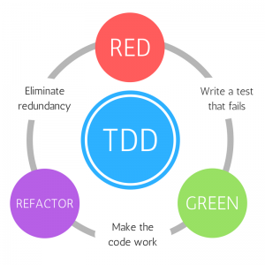
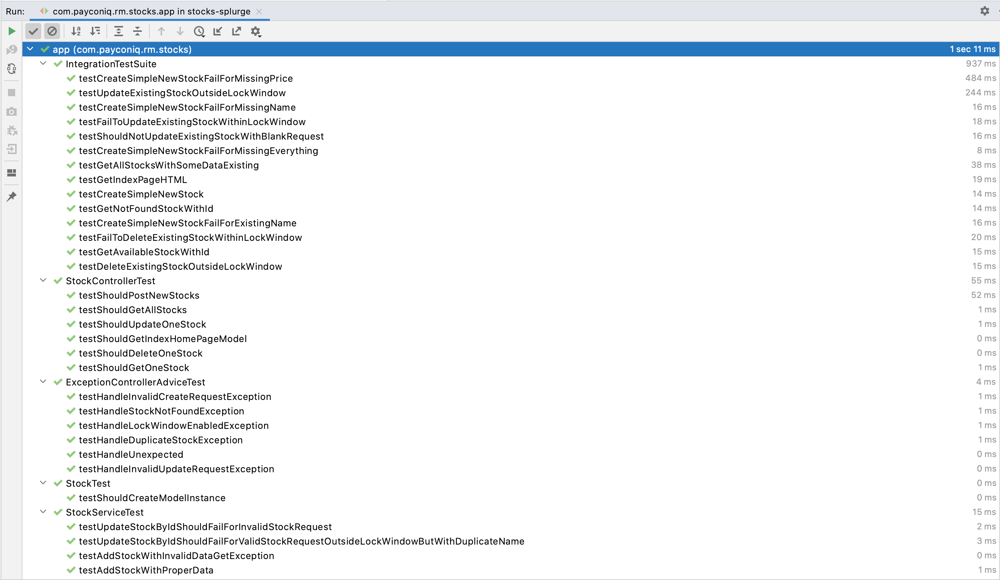
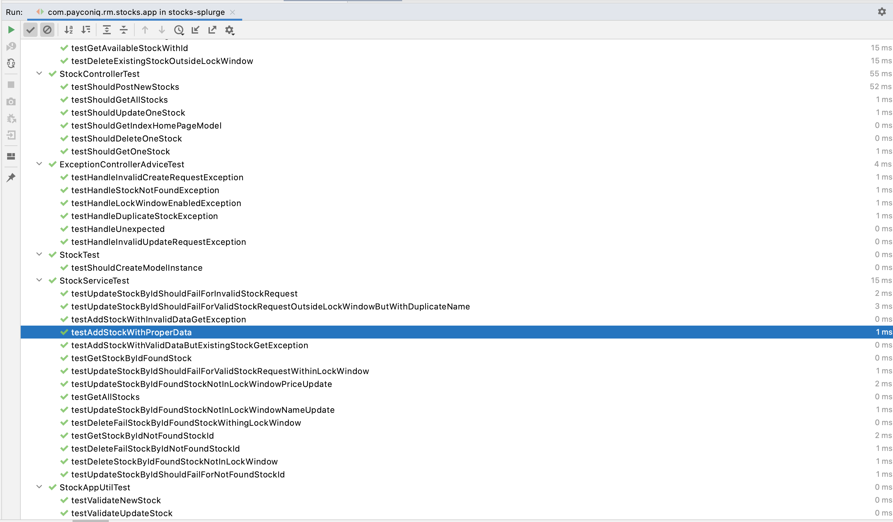
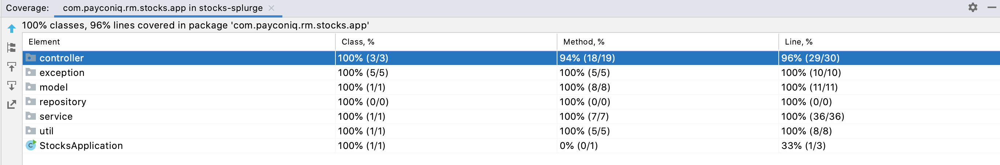
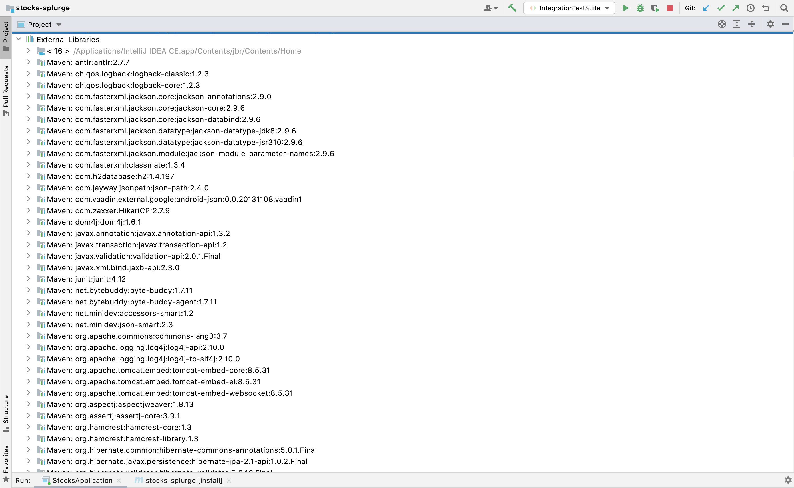
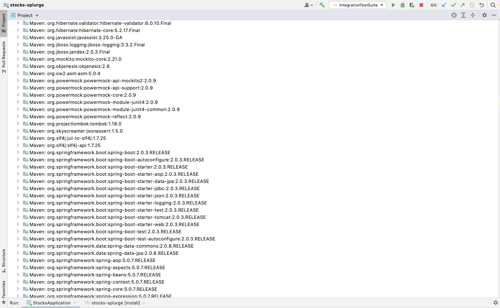
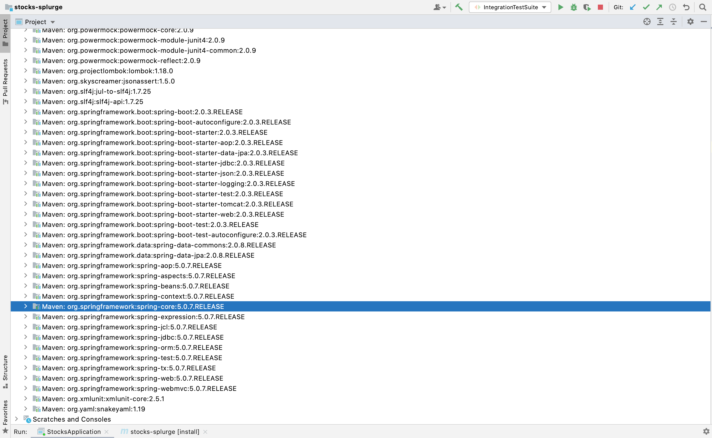

# Stocks Splurge - Stock data REST API
A java spring-boot based REST application to handle stocks based CRUD operations with some locking techniques to prevent short time stock data manipulation.
It is a minimal Proof of concept that adheres to the requirements mentioned in [Here](./Requirements.md)

### Key aspects related to implementation:
- Employing test driven development practice while building application - Each module goes through the `red` -> `fix` -> `green` -> `refactor` cycle
- Intensive unit tests - Mocktio based unit tests to observe interactions of various actors
- Separation of concerns - Modular approach on top of MVC paradigm in giving specific responsibility to each module in the application
    - *Persistence layer* powered by jpa/hibernate libraies taking care of the data persistence with simplified ORM capabilities mapping to relational entities.
    - *Service layer* to handle data persistence and business logics required to invoke the what3words api with the location data supplied
    - *Controller* to handle all the endpoint calls to process the data from users.
    - *Models* to keep track of data that is processed by the system.
    - *ControllerAdvice* to handle all the user defined exceptions handled at the runtime to send proper response code to users to better understand the flow.
- Dependency resolution with Spring-Boot's Auto-configuration and dependency resolution.
- MVC test to support integration testing of the entire Spring Application.
- Lombok - used annotation based pre-processing to reduce a lot of boilerplate code that can be deferred to compile time.
- H2 in memory data base along with the persistence capabilities in java/spring-boot to enable in-memory data management.

## TDD - Red->Green->Refactor cycle


## REST APIs

#### Post new Stock to system
##### Request
```http
POST /api/stocks HTTP/1.1
Host: localhost:8080
Content-Type: application/json

{
     "name":"PCNQ",
     "currentPrice": 12.45
}
```
### Request format:
*name* – the name of the company stock in the system.
*currentPrice* - the price of that particular stock.

##### Response
Returns: The created stock object with reference details.

200 – in case of success
400 – if the request is missing the name or invalid price.
208 – if the name given to update is found in system for other stock.
422 – if one of the fields sent is empty or wrong.
403 - if the request is to update/delte the stock within the lock window.


```http
HTTP/1.1 201 Created
Content-Type: application/json

{
    "id": 1,
    "name": "PCNQ",
    "currentPrice": 12.45,
    "timeCreated": 1636817934,
    "lastUpdated": 1636817934
}

```

OR

```http
HTTP/1.1 208 Already reported
Content-Type: application/json


```

OR

```http
HTTP/1.1 422 Unprocessable Entity
Content-Type: application/json

{
    "message": "Invalid request data passed!"
}

```

#### Get Particular stock in the system with ID
##### Response
Returns: The created stock object with reference details.

200 – in case of success
204 – if the given id is not in the system.

```http
GET /api/stocks/1 HTTP/1.1
Host: localhost:8080

{
    "id": 1,
    "name": "PCNQ",
    "currentPrice": 12.45,
    "timeCreated": 1636817934,
    "lastUpdated": 1636817934
}
```

OR

```http
HTTP/1.1 204 No content
Content-Type: application/json

```


#### Get List of all stocks in the system.
##### Response
Returns: The list of created stock objects with reference details.
200 – in case of success

```http
GET /api/stocks/ HTTP/1.1
Host: localhost:8080

[{
    "id": 1,
    "name": "PCNQ",
    "currentPrice": 12.45,
    "timeCreated": 1636817934,
    "lastUpdated": 1636817934
},{
    "id": 2,
    "name": "ADYN",
    "currentPrice": 45.87,
    "timeCreated": 1636817934,
    "lastUpdated": 1636817934
}]
```


#### Delete Particular stock in the system with ID
##### Response
Returns: The created stock object with reference details.

200 – in case of success
204 – if the given id is not in the system.
403 - if the request is to update/delete the stock within the lock window.

```http
DELTE /api/stocks/1 HTTP/1.1
Host: localhost:8080

{
    "id": 1,
    "name": "PCNQ",
    "currentPrice": 12.45,
    "timeCreated": 1636817934,
    "lastUpdated": 1636817934
}
```

OR

```http
HTTP/1.1 204 No content
Content-Type: application/json

```


OR

```http
HTTP/1.1 402 Forbidden
Content-Type: application/json

{
    "message": "Cannot manipulate stock within Lock window!"
}

```


#### Update Stock name or price in the system with ID
##### Request
```http
PUT /api/stocks/1 HTTP/1.1
Host: localhost:8080
Content-Type: application/json

{
     "name":"PCNQ2",
     "currentPrice": 23.32
}
```
### Request format:
*name* – the name of the company stock in the system.
*currentPrice* - the price of that particular stock.

##### Response
Returns: The created stock object with reference details.

200 – in case of success
400 – if the request is missing the name or invalid price.
208 – if the name given to update is found in system for other stock.
422 – if one of the fields sent is empty or wrong.
403 - if the request is to update/delete the stock within the lock window.

```http
HTTP/1.1 200 OK
Content-Type: application/json

{
    "id": 1,
    "name": "PCNQ2",
    "currentPrice": 23.32,
    "timeCreated": 1636817934,
    "lastUpdated": 1636817934
}

```

OR

```http
HTTP/1.1 208 Already reported
Content-Type: application/json


```

OR

```http
HTTP/1.1 400 Bad Request
Content-Type: application/json

{
    "message": "Blank request cannot be updated!"
}

```


OR

```http
HTTP/1.1 402 Forbidden
Content-Type: application/json

{
    "message": "Cannot manipulate stock within Lock window!"
}

```


### Test Coverage





### Dependencies




## Testing
This application is build following TDD principles and are rich with various integration/unit tests based on test pyramids
To run all the tests:

```bash
mvn clean test
```

## Build
In order to build this application, run the following maven command.
```bash
mvn clean package
```
### installing the packages
With Tests:
```bash
$ mvn clean install -U
```
### running tests
Unit tests:
```bash
$ mvn  test
```

>         Developed in Jetbrain's IntelliJ IDE

## References
- mocktio failing for API class: https://stackoverflow.com/a/58200905
- json name setting: https://stackoverflow.com/q/40969156
- `handlerExceptionResolver` not found bean issue : https://stackoverflow.com/a/56121977
- json ignore fields: https://www.baeldung.com/jackson-ignore-null-fields
- integration testing: https://stackoverflow.com/a/35402975
- Mock external API call :
    - https://stackoverflow.com/questions/20504399/testing-springs-requestbody-using-spring-mockmvc
    - using wiremock : https://stackoverflow.com/a/40908543
    - using easymock: https://stackoverflow.com/a/61685017
- assert json content in mvc testing : https://stackoverflow.com/a/41670634
- serving html/static content via rest controller : https://stackoverflow.com/a/47170750
- spring-boot jpa with h2 in-memory:
 - https://spring.io/guides/gs/accessing-data-jpa/
 - https://www.baeldung.com/spring-boot-h2-database
- jquery UI:
 - Modal: https://api.jqueryui.com/dialog/
 - closing modal: https://stackoverflow.com/a/58323185
 - dynamic string with data from variable:
- $.ajax : https://www.w3schools.com/jquery/ajax_post.asp
   - https://stackoverflow.com/a/2845487
   - error handling: https://stackoverflow.com/q/377644
- events on dynamic buttons: https://stackoverflow.com/a/20030230
- js date from epoch time: https://stackoverflow.com/a/8016205
- dynamically changed accordion content not applying effect issue: https://stackoverflow.com/a/31584133

## License

MIT
